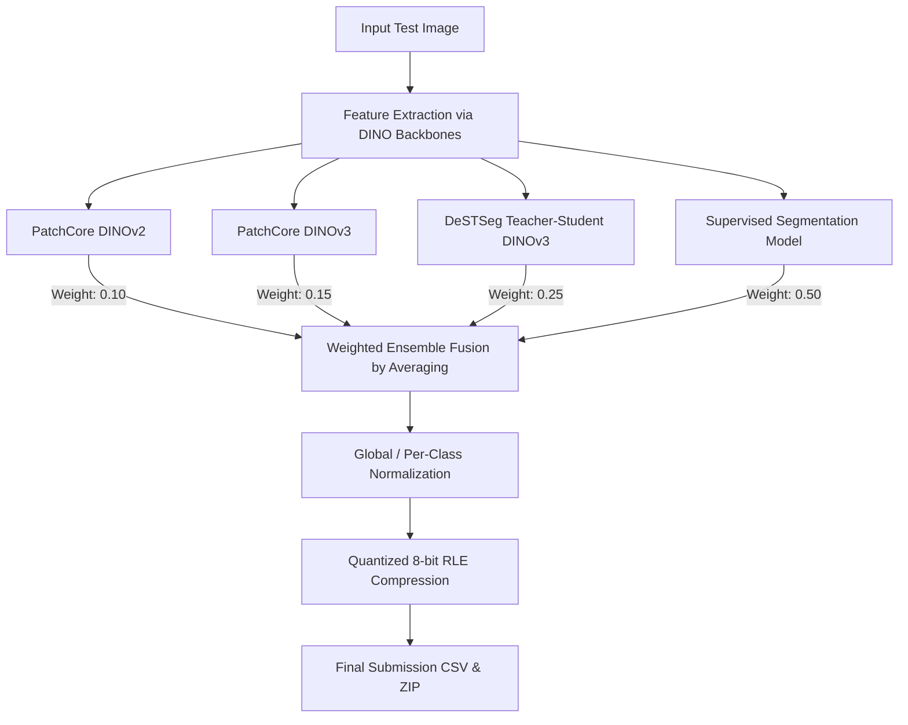

# Industrial Anomaly Segmentation
### Politecnico di Milano — Advanced Deep Learning Challenge 2025/2026

This repository contains the project code, models, and reports developed for the **Advanced Deep Learning (ADL)** course during the 2025/2026 academic year as part of the MSc in Computer Science & Engineering at **Politecnico di Milano**.

The work here represents the collective effort of team 21 GANs (Riccardo Piantoni, Domenico Piscitelli, and Antonio Riverso) in the ADL competition, focusing on developing a state-of-the-art anomaly segmentation system designed for industrial quality control.

The task requires detecting and precisely segmenting pixel-level anomalies across **8 distinct industrial categories** (comprising complex textures and structures). The solution leverages a powerful **weighted ensemble of foundation models (DINOv2 & DINOv3)** combined with zero-shot (PatchCore), self-supervised (DeSTSeg) and supervised anomaly segmentation methods.

---

## 🌟 Solution Architecture Overview

To achieve robust generalization across both structural objects and complex textures, this project implements a multi-paradigm ensemble strategy:

### 1. Zero-Shot Memory Bank Anomaly Detection (PatchCore)
* **Backbones:** Parallel implementations using **DINOv2** and **DINOv3**.
* **Mechanism:** Constructs a local neighborhood-aware patch-level memory bank from healthy/normal training images. Coreset subsampling is applied to compress the memory bank, ensuring rapid, highly accurate nearest-neighbor distance estimation to generate high-resolution anomaly heatmaps.

### 2. Teacher-Student Anomaly Segmentation (DeSTSeg)
* **Backbone:** Frozen state-of-the-art **DINOv3** ViT-L/16 foundation model.
* **Mechanism:** A Teacher-Student framework containing **3 trainable student networks per class** that learn to reconstruct the frozen teacher's multi-scale representations (extracted from layers `-4, -8, -12`).
* **Augmentations:** Enhanced via **faithful real-patch cut-paste** data augmentation to generate synthetic anomaly maps, paired with a custom **whole-real-anomaly replay** for the segmentation head (specifically optimized for challenging classes like gears/class_03).

### 3. Supervised Segmentation Model
* **Mechanism:** Fine-tuned supervised segmentation network optimized to segment known defect classes based on the small set of training anomalies and pixel-level validation masks provided.

### 4. Weighted Ensemble Integration
* **Fusion Formula:**

  $$\text{AnomalyMap} = 0.50 \cdot \mathbf{M}_{\text{Supervised}} + 0.25 \cdot \mathbf{M}_{\text{DeSTSeg (DINOv3)}} + 0.15 \cdot \mathbf{M}_{\text{PatchCore (DINOv3)}} + 0.10 \cdot \mathbf{M}_{\text{PatchCore (DINOv2)}}$$
* **Post-Processing:** Applies global and per-class normalization bounds, scales maps back to the original image dimensions, and compresses the result using a custom Quantized 8-bit Run-Length Encoding (`q8rle`) scheme for optimized submission sizes.

---

## 📊 Dataset Structure & Statistics

The dataset is structured similarly to industrial standards (e.g., MVTec AD), featuring normal training data and limited anomalous validation images with ground truth masks:

| Class | Object / Texture Type | Train Normal | Train Anomaly Types | Train Anomaly Images | Test Images |
| :--- | :--- | :---: | :---: | :---: | :---: |
| **Class 01** | Resistor | 2,600 | 5 | 25 | 465 |
| **Class 02** | Inductor | 2,135 | 6 | 30 | 800 |
| **Class 03** | Gear | 2,520 | 4 | 20 | 790 |
| **Class 04** | Category 4 | 2,585 | 5 | 25 | 745 |
| **Class 05** | Category 5 | 2,640 | 6 | 30 | 225 |
| **Class 06** | Category 6 | 2,335 | 7 | 35 | 1,010 |
| **Class 07** | Category 7 | 2,145 | 7 | 35 | 915 |
| **Class 08** | Category 8 | 2,045 | 7 | 35 | 960 |

---

## 📂 Deliverables Directory Structure

* 📂 **`patchcore_dinov2.ipynb`**: Re-implementation of PatchCore utilizing a frozen DINOv2 backbone for feature extraction and memory bank matching.
* 📂 **`patchcore_dinov3.ipynb`**: PatchCore leveraging Meta's advanced DINOv3 foundation model, improving boundary precision.
* 📂 **`destseg_dinov3.ipynb`**: Comprehensive DeSTSeg setup featuring a multi-student layout, custom real-patch cut-paste, whole-anomaly replay, validation, and streaming test predictions.
* 📂 **`anomaly_supervised_v2.ipynb`**: Supervised segmentation network trained on annotated validation defects.
* 📂 **`weighted_ensemble.ipynb`**: The pipeline to aggregate predictions, run normalization, and compile the final `q8rle` encoded submission file.
* 📄 **[ADL Challenge Report - 21 GANs.pdf](./deliverables/ADL%20Challenge%20Report%20-%2021%20GANs.pdf)**: Detailed technical report describing the methodology, design choices, validation results, and ensemble strategies.

---

## 🚀 Steps to Reproduce

### 🔑 0. Hugging Face Access & Hardware Setup
* Since **DINOv3** (`facebook/dinov3-vitl16-pretrain-lvd1689m`) is a gated model, you must request access on its [Hugging Face Repository](https://huggingface.co/facebook/dinov3-vitl16-pretrain-lvd1689m).
* Generate a Hugging Face **Access Token** and save it as a Kaggle Secret or Colab Environment Variable named `HF_TOKEN`.
* *Note: All notebooks are fully tested and optimized for execution on **Kaggle** (utilizing Tesla T4 or P100 GPUs) and may require slight path changes for Google Colab.*

### 🏃‍♂️ 1. Run Single Model Notebooks
Execute the following notebooks in your environment to train the individual models and output their respective anomaly map predictions:
1. Run `patchcore_dinov2.ipynb` $\rightarrow$ Outputs `submission_patchcore.csv`
2. Run `patchcore_dinov3.ipynb` $\rightarrow$ Outputs `submission_patchcore_dinov3.csv`
3. Run `destseg_dinov3.ipynb` $\rightarrow$ Outputs `submission_dino_destseg.csv`
4. Run `anomaly_supervised_v2.ipynb` $\rightarrow$ Outputs `submission_supervised.csv`

*(Make sure to ignore files starting with `validation_*` which are reserved for local evaluation).*

### 📦 2. Compile Submission Datasets on Kaggle
1. Load the challenge dataset and the four generated submission files (`.csv`) into a private Kaggle Dataset.
2. Alternatively, you can add the following pre-compiled datasets directly to your Kaggle notebooks (available publicly):
   * [Dataset 1: Anomaly Detection Source Data](https://kaggle.com/datasets/bd165c309d1abc50df91f2d3f71dd6bc5447c64df7898d3a01fc93d4fafe22ec)
   * [Dataset 2: Intermediate Model Submissions](https://kaggle.com/datasets/9f07cc77a57bd523941b3697399de8198a4a7a5e59e4e520baaaa2f8d9594054)

### 🔗 3. Execute the Ensemble
1. Attach the compiled datasets to the `weighted_ensemble.ipynb` notebook.
2. Run the notebook to compute global and per-class normalization limits, interpolate resolution sizes, perform the weighted fusion, and produce the final compressed `submission_weighted_ensemble.zip` file.

---

## 🎓 Course Details & Context
* **University:** Politecnico di Milano (PoliMi)
* **Master's Course:** Advanced Deep Learning (A.Y. 2025/2026)
* **Challenge:** Industrial Anomaly Segmentation & Detection